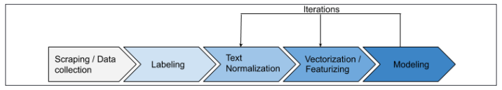

###### Tóm tắt
* Trong chương này, sẽ tìm hiểu các kiến thức cơ bản trong tiền xử lí văn bản và xây dựng một **simple spam detector** [trình phát hiện thư rác đơn giản]. Cụ thể sẽ tìm hiểu về:
  * Text pre-processing.
  * Data collection và labeling.
  * Text normalization bao gồm **case normalization** [chuẩn hóa chữ hoa chữ thường], text tokenization, stemming và lemmatization.
    * Modeling datasets mà đã được normalized.
    * Vectorizing text.
    * Modeling datasets với vectorized text.

# 1. A typical text processing workflow
* Để hiểu về text processing, cần hiểu truy trình làm việc chung của NLP, hãy xem hình sau:
  
  